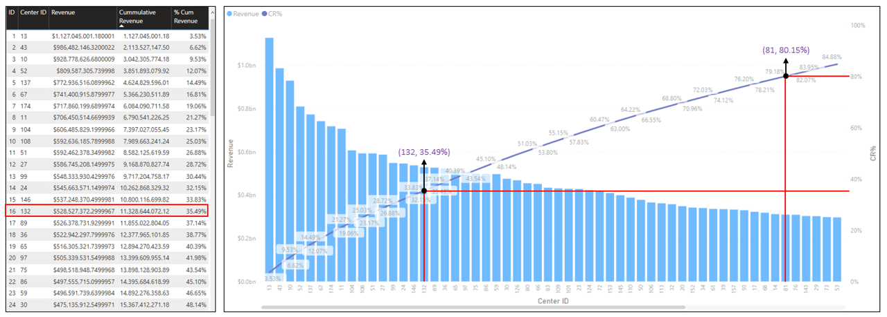

# Food Delivery Analytics on Microsoft PowerBI

This is a personal project attempted to discover insights into a food delivery business.

This projects was built on Microsoft PowerBI. It covers key steps in a data analytics projects including data cleansing, data transformation, exploratory analysis, and data visualisation. Additionally, the project leverages PowerBI's AI capabilitites such as Key Influencers and Predictive Analytics. Some business principles including Pareto were observed to identify relationship between revenue and delivery locations/meals. 

#### Overview

## Dataset

### Overview

The data used in this project is a dataset of a meal delivery company based in India provided by Analytics Vidhya professional training team. Data can be found [here](data). It consist of three files:

* fulfilment_center_info.csv
* meal_info.csv
* weekly_demand_data.csv

#### fulfilment_center_info.csv

This data contains the information about the business' delivery locations. Columns include Center ID, Center Type, City Code, Operation Area, and Region Code.

#### meal_info.csv

This data contains the information about the meals covered by the business. Columns include Meal ID, Category, and Cuisine.

#### weekly_demand_data.csv

This data contains weekly revenue and number of orders of meals across the delivery locations. Columns include Order ID, Center ID, Meal ID, Date, Number of Orders, Base Price, Checkout Price, Emailer for Promotion, and Homepage Featured.

## Analytics

Dataset covers weekly demand data across the business' 77 different locations for 145 weeks between three consecutive years. Within this period, the business successfully delivered over 120 million orders comprising of 51 contrasting but delectable meals including Indian, Thai, Italian, and Continental Cuisines. The revenue generated amounted to over $31.92 billion.

### Pareto Principle

According to Investopedia, it is an observation that often a small subset of many causes are responsible for the most observation. The original observation of the Pareto Principle was linked to the relationship between wealth and population. In accordance to what Pareto said, 80% of the land in Italy was owned by 20% of the population.

Correlatively, we observed if the meal delivery business followed this principle. Is 80% of the business' revenue genrated from 20% of delivery locations? Is 80% of the business' revenue generated from 20% of the meals being delivered?

#### Does Pareto hold for Revenue and Delivery Locations?

Already, we established that there are 77 distinct delivery locations and revenue geenrated within this period was about $31.92 billion. If Pareto were to hold, the top 16 locations (20% of the delivery locations) by revenue should generate at least $25.54 billion (80% of the revenue).

#### Does Pareto hold for Revenue and Meals Delivered?

### Top-N

### Predictive Analytics

### Key Influencers

## Conclusion

## Reference

