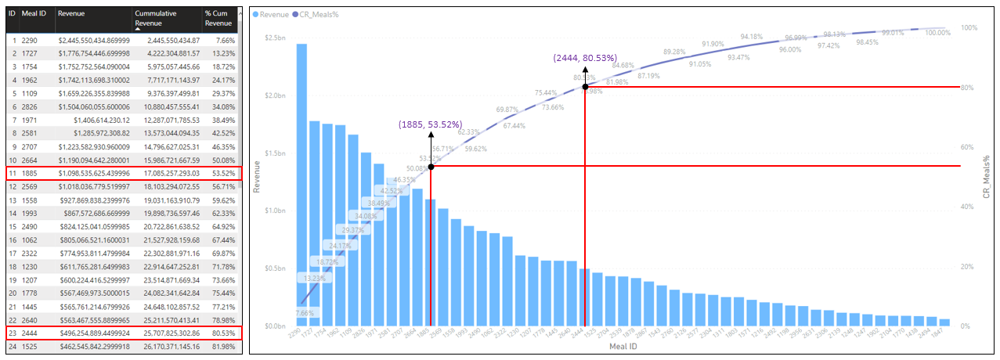

# Food Delivery Analytics on Microsoft PowerBI

This is a personal project attempted to discover insights into a food delivery business.

This projects was built on Microsoft PowerBI. It covers key steps in a data analytics projects including data cleansing, data transformation, exploratory analysis, and data visualisation. Additionally, the project leverages PowerBI's AI capabilitites such as Key Influencers and Predictive Analytics. Some business principles including Pareto were observed to identify relationship between revenue and delivery locations/meals. 

#### Overview

## Dataset

### Overview

The data used in this project is a dataset of a meal delivery company based in India provided by Analytics Vidhya professional training team. Data can be found [here](data). It consist of three files:

* fulfilment_center_info.csv
* meal_info.csv
* weekly_demand_data.csv

#### fulfilment_center_info.csv

This data contains the information about the business' delivery locations. Columns include Center ID, Center Type, City Code, Operation Area, and Region Code.

#### meal_info.csv

This data contains the information about the meals covered by the business. Columns include Meal ID, Category, and Cuisine.

#### weekly_demand_data.csv

This data contains weekly revenue and number of orders of meals across the delivery locations. Columns include Order ID, Center ID, Meal ID, Date, Number of Orders, Base Price, Checkout Price, Emailer for Promotion, and Homepage Featured.

## Analytics

Dataset covers weekly demand data across the business' 77 different locations for 145 weeks between three consecutive years. Within this period, the business successfully delivered over 120 million orders comprising of 51 contrasting but delectable meals including Indian, Thai, Italian, and Continental Cuisines. The revenue generated amounted to over $31.92 billion.

### Pareto Principle

It is an observation that often a small subset of many causes are responsible for the most observation. The original observation of the Pareto Principle was linked to the relationship between wealth and population. In accordance to what Pareto said, 80% of the land in Italy was owned by 20% of the population.

Correlatively, we observed if the meal delivery business followed this principle. Is 80% of the business' revenue generated from 20% of delivery locations? Is 80% of the business' revenue generated from 20% of the meals being delivered?

#### Does Pareto hold for Revenue and Delivery Locations?

Already, we established that there are 77 distinct delivery locations and revenue generated within this period was about $31.92 billion. Center 13 appears to be the most productive delivery location by revenue. If Pareto were to hold, the top 16 locations (20% of the delivery locations) by revenue should generate at least $25.54 billion (80% of the revenue).

Evidently, the cumulative revenue at the 16th delivery center is about 35% of the total generated revenue - way off our Pareto expectation of 80% revenue. In reality, the analysis shows that 80% of the revenue is generated by the top 51 delivery centers - about two-third of the business' total delivery centers.

#### Does Pareto hold for Revenue and Meals Delivered?

Similarly, there are 51 distinct meals delivered across the business locations distributed into 14 categories. The top 5 selling categories are Beverages, Rice Bowl, Sandwich, Pizza, and Salad. The Indian Rice Bowl cuisine if the meal with the highest revenue.

Following Pareto rule, expectedly, the revenue from the top 11 (20% of the meals) delivered meals should account for at least $25.54 billion.

Again, the cumulative revenue for the top 20% of meals do not amount to 80% of the generated revenue. The analysis shows that 80% of the revenue is actually generated by the top 23 delivery centers.

Conclusively, it's important to note that there is a practical reason for applying the Pareto Rule. For example, if 20% of our delivery location is driving 80% revenue, we may want to focus on those locations to maximize the potential value by increasing operation/human power there; or possibly, reward the customers in those regions for their loyalty. 

Similarly, if 20% of our meals are generating 80% revenue, we may wish to produce more of them or explore the possibilites of preparing other varieites of those meals.

In this regard, the Pareto Rule can be a guide for how to allocate resources, time, and man-power efficiently.

Suffice to say, if the business doesn't follow Pareto like our case, it doesn't call for alarm. Confidently, we could say majority of our delivery locations are performing well. Our direction may be focused on the least performing delivery location/meals to identify opportunities for improvement.

### Key Influencers

This inbuilt feature helps you understand the factors that drive a metric you're interested in. It analyzes your data, ranks the factors that matter, and displays them as key influcencers.

In this project, we leveraged this feature to identify, if any, the relationship between the operational area of a delivery location/store and the location's number of orders. Also, a relationship with Emails and Product featured on the homepage was investigated.

#### Email Promotion vs Number of Orders

The `emailer_for_promotion` column is made up of two distinct entries: 0 or 1. 

`0` means the order wasn't driven by an email promotion
`1` means the order was driven by an email promotion

Consequently, the key influencers tells us that there is a direct relationship between number of orders and email promotion. Number of order is likely to increase when the send out promotion email for meals.

#### Homepage Feature vs Number of Orders

The `homepage_featured` column is made up of two distinct entries: 0 or 1. 

`0` means the order wasn't driven by the meal's homepage feature
`1` means the order was driven by the meal's homepage feature

Key influencers identifies that the number of order is likely to increase when a meal is featured in the homepage.

#### Operation Area vs Number of Orders

The `op_area` column is made up of numeric values ranging from 0.9 to 7.0. 

As seen, the number of order increases with increasing operation area. Instinctively, we can agree that locations with smaller spaces will likely drive away potential buyers at that instance. Accordingly, the business owners may consider increasing the operational area to grow sales in centers with low figures.

## Conclusion

Conclusively, we've been able to identify insights into our food delivery business. From Pareto and Key Influencers analysis, we're able to draw opportunities to grow the business revenue even more.

Some other analysis not included in this article include predictive analytics that forecasts the next couple of weeks demands at various confidence intervals, Top-N analysis, and so on.

If you're intersting in accessing the PowerBI file for this project, please do [send me a mail](mailto:chidindego@gmail.com). Thanks for your time. 

## Reference

*   [Pareto Principle](https://www.investopedia.com/terms/p/paretoprinciple.asp)
*   [Key Influencers](https://learn.microsoft.com/en-us/power-bi/visuals/power-bi-visualization-influencers?tabs=powerbi-desktop)

